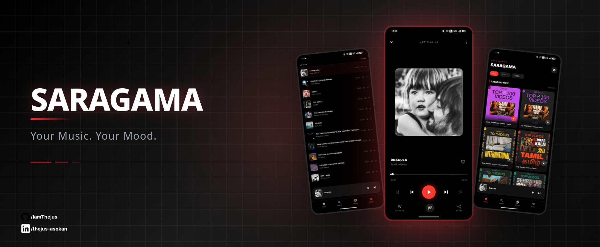
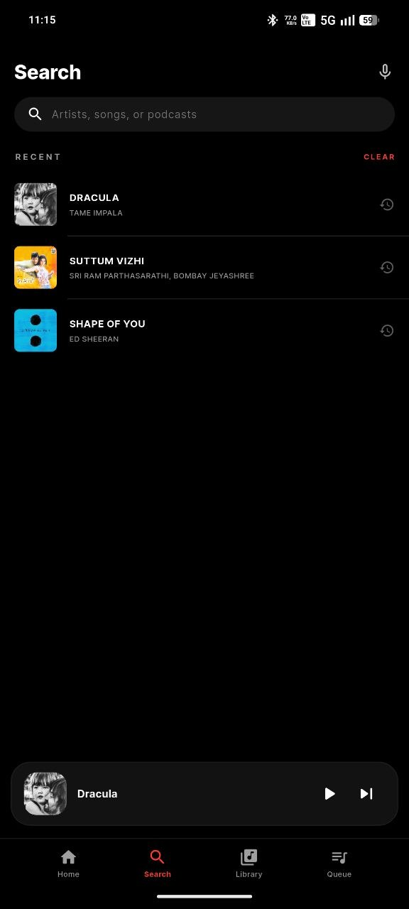
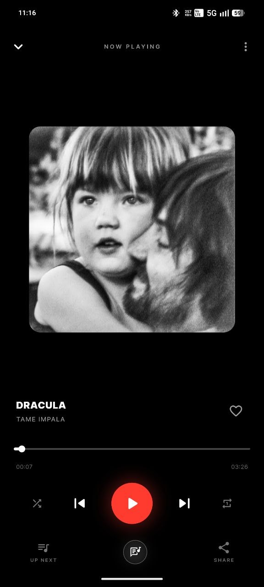
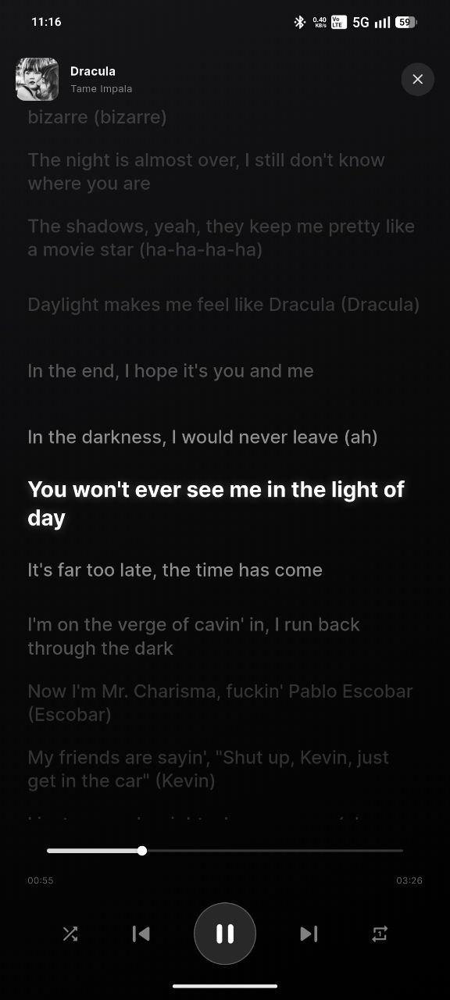
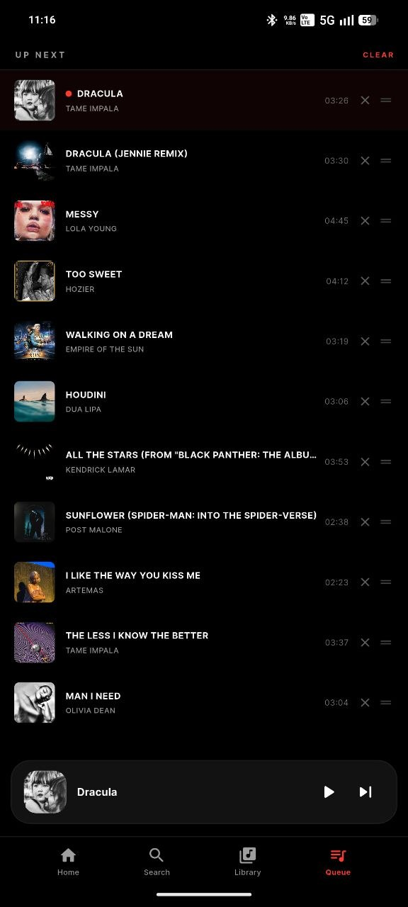
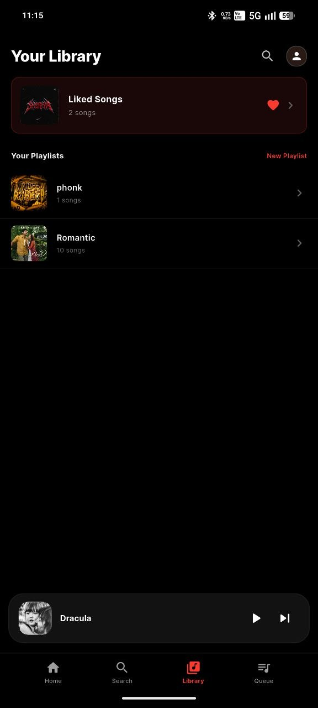

<div align="center">
  
</div>

---

# 🎵 SaraGama — YouTube Audio Player

A cross-platform Flutter music player that streams audio from YouTube. Search for songs, play them instantly, build a queue, and control playback — all with no ads and no video, just audio.

---

## 📱 Screenshots

<div align="center">
  
  
  
</div>
<br/>
<div align="center">
  
  
  
</div>


---

## ✨ Features

- 🔍 **Debounced Search** — type a song name and results appear automatically after 400ms, powered by the Saragama autocomplete API
- ▶️ **Instant Playback** — tap any search result to stream its audio immediately
- ➕ **Queue Management** — add songs to queue, reorder by drag, remove, or jump to any track
- 🖼️ **Rich Metadata** — displays song title, artist name, and album art in the now-playing card
- ⏭️ **Full Playback Controls** — play, pause, skip next/prev, seek, loop single track, shuffle queue
- 📶 **Buffered Progress Bar** — shows both played position and buffered amount
- 💾 **URL Caching** — stream URLs are cached in Hive so the same song doesn't re-fetch from YouTube on replay
- 📻 **Background Playback** — audio continues when the screen is off or you switch apps, with a media notification
- 🎚️ **Quality Toggle** — switch between High Quality (Opus 160kbps / AAC 128kbps) and Low Quality (Opus 70kbps / AAC 48kbps)
- 🆔 **Manual Video ID** — paste any YouTube video ID directly to play it

---

## 🏗️ Architecture

The architecture is inspired by and mirrors **HarmonyMusic**, a production Flutter music streaming app.

```
lib/
├── main.dart                        # App entry, Hive init, AudioService init
├── services/
│   ├── audio_handler.dart           # Core engine — BaseAudioHandler, queue, caching
│   ├── stream_service.dart          # YouTube stream manifest fetching
│   ├── background_task.dart         # Isolate wrapper for stream fetching
│   └── search_service.dart          # Saragama autocomplete API client
├── controllers/
│   ├── player_controller.dart       # GetX reactive bridge between UI and handler
│   └── search_controller.dart       # Debounced search state management
├── models/
│   └── hm_streaming_data.dart       # Typed stream info model (URL, codec, quality)
└── ui/
    └── player_screen.dart           # Full UI — search overlay, player card, queue
```

### How a song plays — step by step

```
User taps a search result
        ↓
PlayerController.playVideoId()
        ↓
MyAudioHandler.customAction("setSourceNPlay")
        ↓
checkNGetUrl()  ← checks Hive URL cache first
        │
        ├── Cache hit + not expired? → use cached URL
        │
        └── Cache miss / expired?
                ↓
            Isolate.run(getStreamInfo())     ← background isolate, UI never blocks
                ↓
            StreamProvider.fetch(videoId)    ← youtube_explode_dart
                ↓
            Returns Audio (itag, url, codec, bitrate, loudnessDb)
                ↓
            Cache result in Hive SongsUrlCache
        ↓
_createAudioSource()  ← LockCachingAudioSource (if cache enabled) or plain URI
        ↓
just_audio → ConcatenatingAudioSource → audio output
        ↓
audio_service → Android media notification + lock screen controls
```

### Key design patterns

| Pattern | Usage |
|---|---|
| `BaseAudioHandler` | All playback logic lives here, decoupled from UI |
| `customAction()` command bus | Internal IPC — `playByIndex`, `setSourceNPlay`, `reorderQueue`, etc. |
| `Isolate.run()` | Stream URL fetching never blocks the main thread |
| GetX `GetxService` + `GetxController` | Dependency injection and reactive state |
| Hive boxes | `AppPrefs` (settings), `SongsUrlCache` (stream URL cache) |
| Debounce via `Timer` | 400ms delay before search API is called |

---

## 🚀 Getting Started

### Prerequisites

- Flutter SDK `>=3.1.5`
- Android NDK `27.0.12077973`
- A physical Android device or emulator (Android 6.0+)

### Installation

```bash
# Clone the repo
git clone https://github.com/IamThejus/SaraGama.git
cd SaraGama

# Install dependencies
flutter pub get

# Run on connected device
flutter run
```

### Android setup (required)

1. In `android/app/build.gradle.kts`, add inside the `android` block:
```kotlin
ndkVersion = "27.0.12077973"
```

2. Replace `android/app/src/main/kotlin/.../MainActivity.kt` with:
```kotlin
package com.example.saraharmony

import com.ryanheise.audioservice.AudioServiceActivity

class MainActivity : AudioServiceActivity()
```

3. In `android/app/src/main/AndroidManifest.xml`, add before `<application>`:
```xml
<uses-permission android:name="android.permission.INTERNET" />
<uses-permission android:name="android.permission.FOREGROUND_SERVICE" />
<uses-permission android:name="android.permission.FOREGROUND_SERVICE_MEDIA_PLAYBACK" />
<uses-permission android:name="android.permission.WAKE_LOCK" />
<uses-permission android:name="android.permission.RECEIVE_BOOT_COMPLETED"/>
```

And inside `<application>`:
```xml
<service android:name="com.ryanheise.audioservice.AudioService"
    android:foregroundServiceType="mediaPlayback"
    android:exported="true">
    <intent-filter>
        <action android:name="android.media.browse.MediaBrowserService" />
    </intent-filter>
</service>

<receiver android:name="com.ryanheise.audioservice.MediaButtonReceiver"
    android:exported="true">
    <intent-filter>
        <action android:name="android.intent.action.MEDIA_BUTTON" />
    </intent-filter>
</receiver>
```

---

## 📦 Key Dependencies

| Package | Purpose |
|---|---|
| `just_audio` | Audio playback engine |
| `audio_service` | Background playback + media notification |
| `youtube_explode_dart` | YouTube stream manifest extraction |
| `get` | State management and dependency injection |
| `hive` + `hive_flutter` | Local key-value storage for caching |
| `http` | Saragama search API calls |
| `google_fonts` | UI typography |

---

## 🔌 APIs Used

| API | Endpoint | Purpose |
|---|---|---|
| Saragama Autocomplete | `https://saragama-render.onrender.com/autocomplete?q=` | Song search suggestions |
| YouTube (via youtube_explode_dart) | Internal | Audio stream URL extraction |
| YouTube Thumbnail CDN | `https://i.ytimg.com/vi/{id}/mqdefault.jpg` | Album art display |

---

## 📄 License

MIT License — feel free to use, modify, and distribute.

---

## 🙏 Acknowledgements

Architecture inspired by [HarmonyMusic](https://github.com/anandnet/Harmony-Music) by anandnet.
